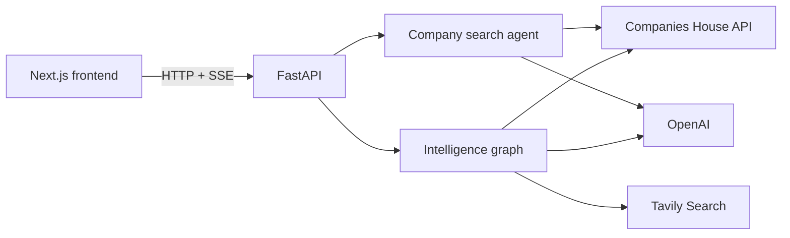
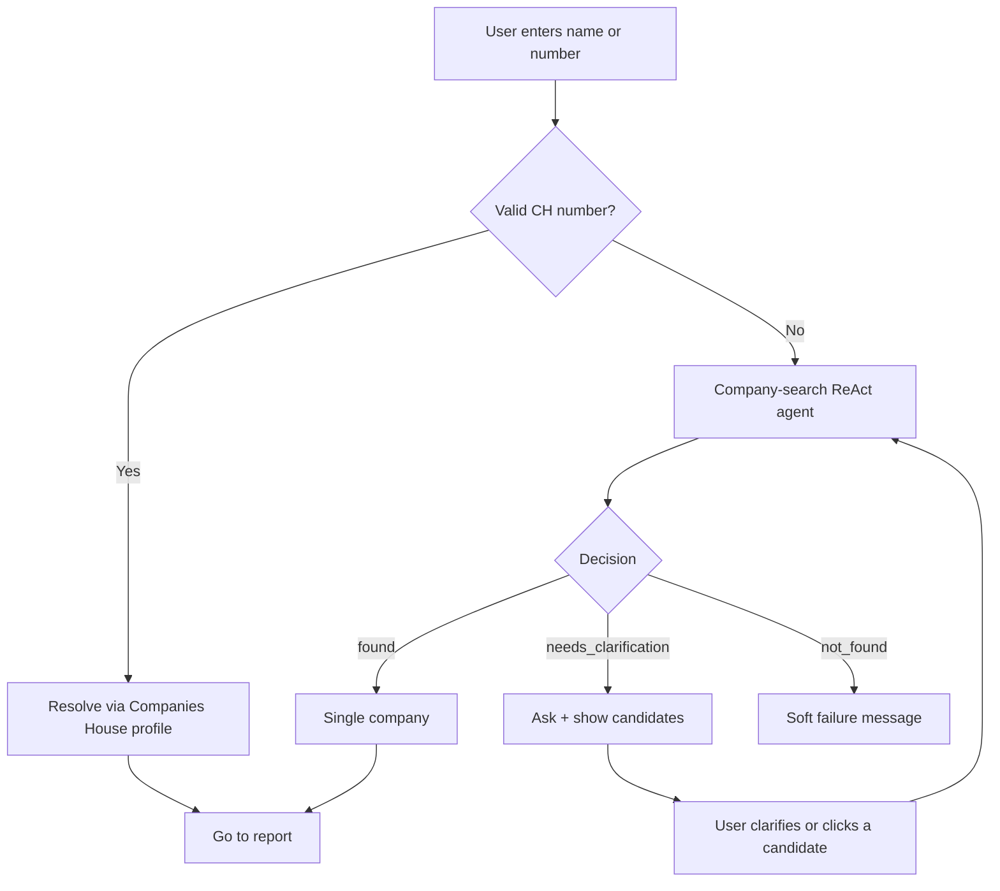
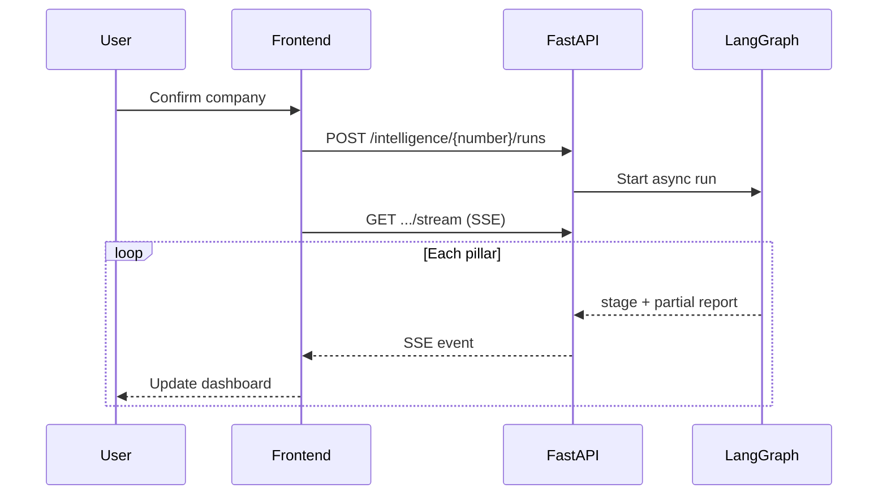
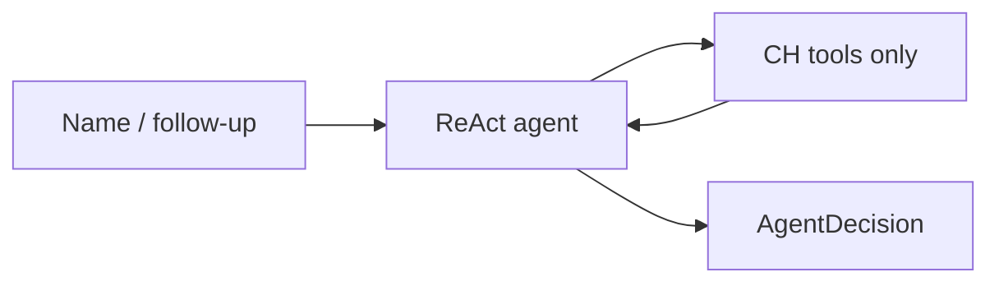
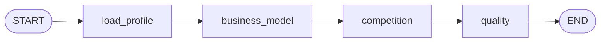
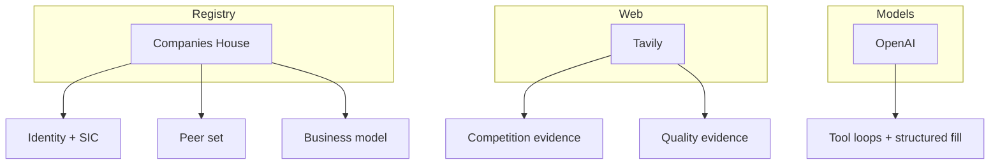
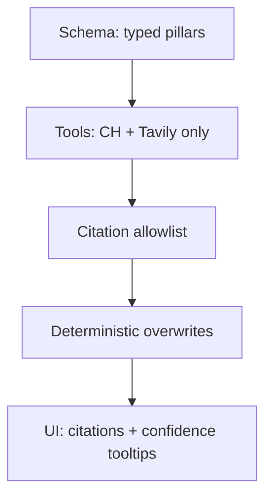
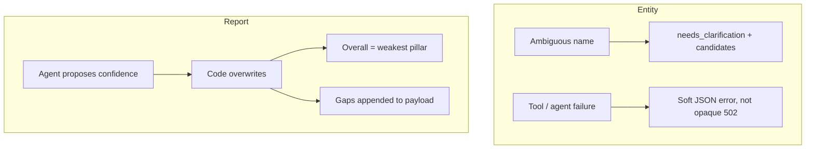
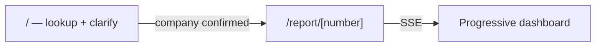

# Citehouse — Architecture

Citehouse turns a UK company name or Companies House number into an explainable, citation-backed intelligence report for underwriting-style review.

**Report pillars**

1. Business-model summary  
2. Competitive intensity (sector / geography)  
3. Company quality (customer / trade press)

---

## High-level system



| Layer | Role | Location |
|--------|------|----------|
| Frontend | Lookup UX + progressive report | `frontend/` |
| API | Thin HTTP for search + runs | `backend/routers/` |
| Agents | ReAct tools + structured outputs | `backend/agents/` |
| Services | External I/O | `backend/services/` |
| Schemas | Pydantic report contracts | `backend/schema/` |

**Why this split:** entity resolution and report synthesis are separate product problems. The API stays thin; grounding lives next to the graph.

---

## User flows

### 1. Find the company



Tools (Companies House only): `search_companies`, `filter_companies`, `get_company`. Max 5 search attempts so the agent can retry before giving up.

### 2. Build the report



Dashboard order: **Profile → Business model → Competition → Quality**.

---

## Agent orchestration

### Company-search agent



| | |
|--|--|
| Framework | LangGraph `create_react_agent` |
| Output | `found` / `needs_clarification` / `not_found` |
| Sources | Companies House only — never invent an entity from the web |

### Intelligence graph



| Node | Tools | Output |
|------|--------|--------|
| `load_profile` | CH profile (deterministic) | `CompanyIdentity` |
| `business_model` | `get_company_profile` | `BusinessModelSection` |
| `competition` | profile, peers, web search | `CompetitionSection` |
| `quality` | web search (+ profile context) | `QualitySection` |

**Design choices**

- Sequential so later pillars can use earlier structured context.
- After each agent, deterministic code overwrites peers, rivalry, confidence, and citations.
- SSE streams pillars as they finish.

---

## Data sources



| Source | Used for |
|--------|----------|
| Companies House | Profile, search, peers |
| Tavily | Competition / quality snippets + URLs |
| OpenAI | Agents + structured sections |

Business model is **CH-only**. Competition and quality use web search with identity-oriented queries. Peers are re-fetched after the competition agent so the UI list is complete.

---

## Grounding

Evidence is constrained in layers — schema → tools → post-filters → UI.



**Citation allowlist** (`citations.py`)

1. Web URLs must match that run’s Tavily results.  
2. CH refs must be known paths (e.g. `companies_house:profile.sic_codes`).  
3. Invalid citations are stripped; a gap note records removals.

This proves **source provenance**, not that every sentence is entailed by a citation.

**Deterministic overwrites**

| Field | Source of truth |
|-------|-----------------|
| Peer set / count / arena | Fresh `search_peers` |
| Rivalry score | Peer-count banding (1–5) |
| Pillar confidence | Rules in `confidence.py` |
| Confidence factors | Boolean ticks for UI tooltips |

---

## Uncertainty



| Pillar | Higher confidence when… | Low when… |
|--------|-------------------------|-----------|
| Business model | SIC codes present → medium | No SIC |
| Competition | Peers + web name match + address corroboration → high; peers only → medium | No peers |
| Quality | Attributable Trustpilot review page **and** trade/news URL naming the company, plus profile corroboration → medium | Either site missing |

UI shows ✓ / unmet criteria in confidence tooltips. Still model-judged: free-text summaries, BM tags, and quality score (1–5).

---

## API

| Method | Path | Purpose |
|--------|------|---------|
| `GET` | `/api/health` | Liveness |
| `GET` | `/api/search/by-company-number/{number}` | Direct CH resolve |
| `POST` | `/api/search/agentic` | Agentic name search |
| `POST` | `/api/intelligence/{number}/runs` | Start report |
| `GET` | `/api/intelligence/runs/{id}/stream` | SSE progress |
| `GET` | `/api/intelligence/runs/{id}` | Snapshot |

Runs live in-memory and under `backend/.runs/` — fine for demo, not multi-instance production.

---

## Frontend



Shared confidence helpers in `frontend/lib/confidence.ts` stay aligned with backend rules.

---

## LLM usage

| Workload | Model | Env |
|----------|-------|-----|
| Company search | `gpt-5.6-luna` | `OPENAI_MODEL` |
| Intelligence pillars | `gpt-5.6-terra` | `OPENAI_INTELLIGENCE_MODEL` |

Both use `reasoning_effort=none` because LangGraph ReAct runs on Chat Completions + function tools. Luna for cheap tool loops; Terra for stronger synthesis.

---

## Trade-offs

| Decision | Benefit | Cost |
|----------|---------|------|
| CH-only business model | No fabricated websites | Less product/market detail |
| Sequential pillars | Clear provenance | Higher latency than parallel |
| Citation allowlist | Blocks invented sources | No NL entailment |
| Deterministic confidence | Auditable uncertainty | Heuristic false positives |
| In-memory + file runs | Fast local demo | No HA / shared store |

---

## Repo map

```
citehouse/
├── ARCHITECTURE.md
├── README.md
├── frontend/          # Next.js UI
└── backend/
    ├── routers/       # HTTP API
    ├── agents/
    │   ├── company_search/
    │   └── intelligence/   # graph, citations, confidence
    ├── services/      # CH, peers, web, runs
    └── schema/        # Report contracts
```

**Config:** see `backend/.env.example` and root `README.md`.
